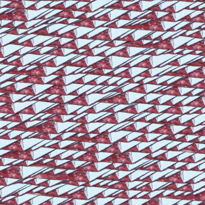
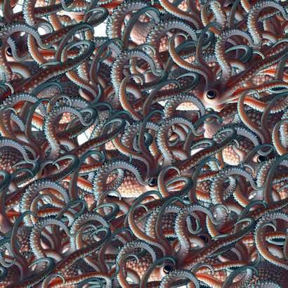
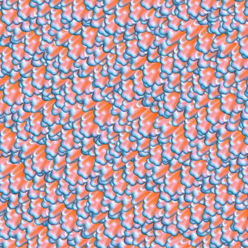
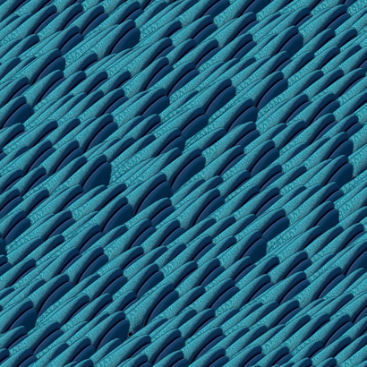
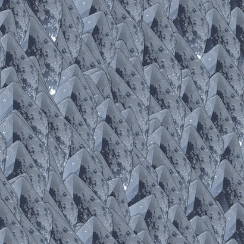
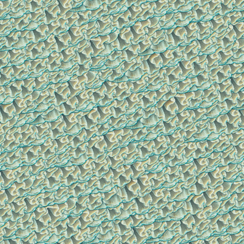
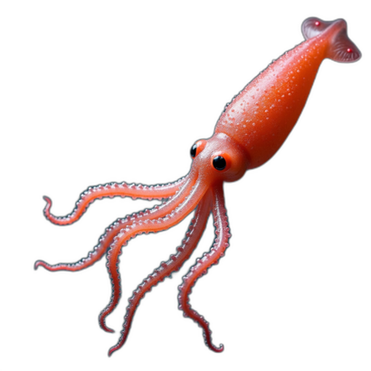
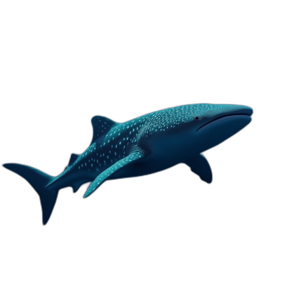
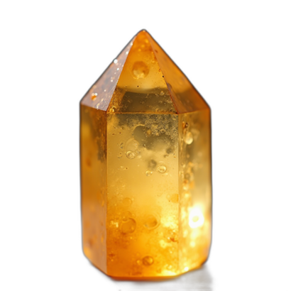
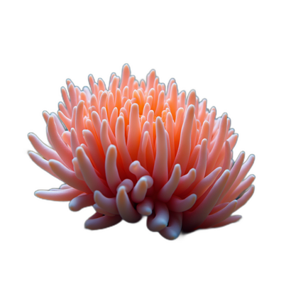

# Cutout Textures

Create random textures using generated cutout images.









This is a small collection of scripts and example cutouts to generate textures. More generated cutout-textures can be found here: [selected](textures_selection) and [all](https://huggingface.co/datasets/piebro/cutout-textures).

The [cutouts](cutouts) are generated with Flux.1 [dev] using fal.ai. Then the backgrounds of all the [images](cutouts_with_background) are removed using a model at fal.ai again. Here are some examples of these cutouts:






The textures are generated by placing them as a grid on a new image with some scale, rotation, and position noise.

## Usage

```bash
# create image for cutouts
python3 flux_dev.py \
 --output "cutouts_with_background" \
 --num-images 2 \
 --size square_hd \
 "a photo of a fish" \
 "a photo of a jelly fish" \
 "a photo of a coral" \
 "a photo of a whale"

# remove the background of all images in "full_images" and save them in "cutouts"
# if the background was removed previously and saved there, skip it
python3 remove_background.py cutouts_with_background cutouts

# use a cutout to generate an image with default parameters
python3 generate_texture.py cutouts/a_photo_of_a_coral_00.png output.png

# use a cutout to generate an image with custom parameters
python3 generate_texture.py \
 cutouts/a_photo_of_a_fish_01.png \
 output.png \
 --canvas-size 1024 1024 \
 --base-dx-range 50 200 \
 --base-dy-range 50 200 \
 --base-cutout-angle-range 0 360 \
 --base-scale-range 0.5 1.5 \
 --position-variation-range -20 20 \
 --scale-variation-range 0.8 1.2 \
 --angle-variation-range -15 15 \
 --grid-tilt-range -180 180 \
 --seed 449230249 \
 --add-center-cutout

# get the command to reproduce an image
python3 get_cmd_from_image.py textures_selection/a_photo_of_a_big_squid_00_04.png

# run a batch of generating new textures for all images in a folder with custom or default parameters
python3 batch_generation.py cutouts_selection textures \
 '{}' \
 '{}' \
 '{"base-dx-range":[50, 200], "base-dy-range": [50, 200], "base-scale-range": [0.5, 1.5], "position-variation-range": [-6, 6], "scale-variation-range": [0.95, 1.05], "angle-variation-range": [-5, 5]}' \
 '{"base-dx-range":[20, 70], "base-dy-range": [20, 80], "base-scale-range": [0.5, 1.5], "position-variation-range": [-3, 3], "scale-variation-range": [0.96, 1.04], "angle-variation-range": [-4, 4]}'

# convert all images in a folder to .jpg images
mogrify -format jpg *.png
```

## License

All code in this project is licensed under the MIT License. See the [LICENSE](LICENSE) file for details. The Images are licensed under the CC0 1.0 License.